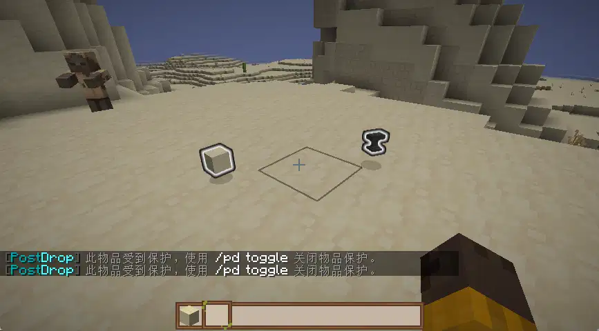

# 开始

PostDrop 是一个简单而实用的 Minecraft 物品丢弃保护插件，可以防止其他玩家拾取您丢弃的物品。

## 📚 功能特性

- **🔒 物品保护**：玩家丢弃的物品默认受到保护，只有丢弃者可以拾取
- **✨ 物品高亮**：受保护的物品会有发光效果，方便玩家识别
- **👁️ 物品可见性控制**：可以配置受保护的物品对其他玩家是否可见（需要ProtocolLib）
- **🔄 玩家自主控制**：玩家可以自行切换是否保护丢弃的物品
- **🔔 自动更新检查**：自动检查并提示新版本
- **🌐 多语言支持**：内置中文和英文语言包
- **📊 变量支持**：支持PlaceholderAPI变量，可用于计分板、全息图等

