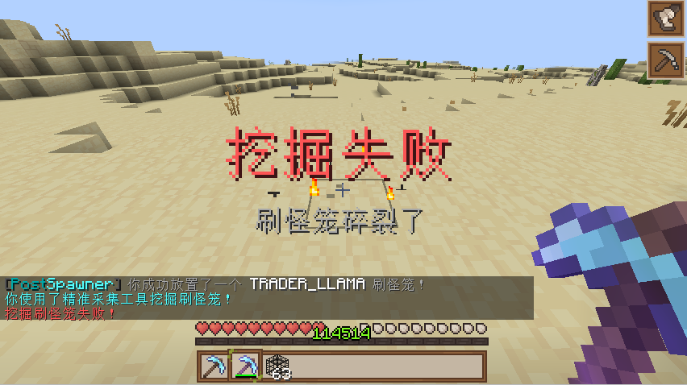
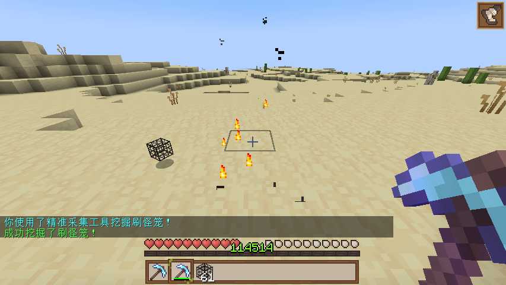

# 开始

PostSpawner 是一个刷怪笼控制插件，支持挖掘，放置，破坏几率等。

## 📚 功能特性

- ✅ **刷怪笼管理**：支持精准采集和普通工具挖掘刷怪笼
- ✅ **多语言支持**：内置中文和英文语言文件，可轻松扩展
- ✅ **丰富的动作系统**：支持命令执行、物品掉落、音效播放等多种动作
- ✅ **钩子系统**：兼容 PlaceholderAPI、ItemsAdder、MythicMobs、NeigeItems、Oraxen 等插件
- ✅ **灵活配置**：完全可自定义的配置和消息系统
- ✅ **更新检查**：提供可关闭的更新检查功能

<!-- 

 -->
